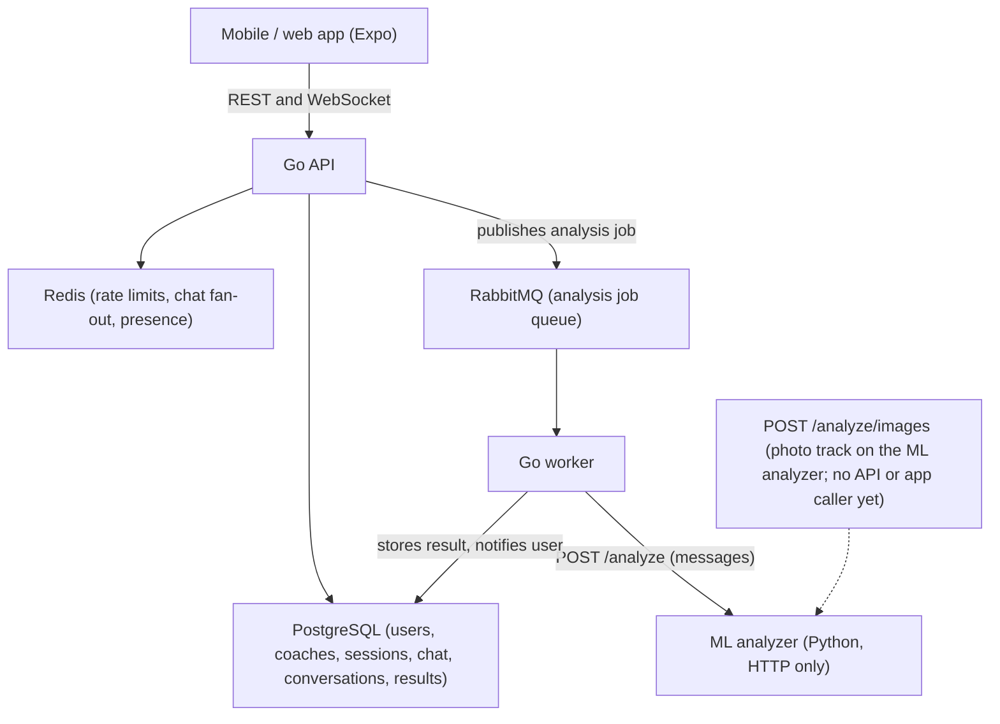

# Dating Coach — product & architecture overview

This document is for people evaluating the product: investors first, technically curious readers second. It explains what the platform does, why its approach to AI feedback is different, how the pieces fit together, and how the product gets better with use. Every claim here is drawn from the code and documentation in this repository; the engineering detail lives in the root [`README.md`](../README.md) and [`ml-analyzer/README.md`](../ml-analyzer/README.md).

Where a technical term is unavoidable it is defined on first use.

---

## 1. What it is

Dating Coach is a platform that helps people get better at dating conversations. It has two product surfaces that share one account and one mobile/web app:

1. **Human coaching.** Clients browse a directory of professional coaches, book a session against the coach's real, published availability, or open a live chat with a coach. Coaches (accounts with the `coach` role) get their own dashboard of upcoming sessions and active chats.

2. **AI conversation and photo analysis.** A client pastes in a conversation from a dating app and receives scores for each stretch of the conversation plus concrete hints about how *their own* messages landed. The same analysis service also has a photo track that gives a verdict, per profile photo, on clarity and on whether the client is clearly the subject. Both kinds of feedback are tailored to the preferences the client has written about what they are looking for. Today the conversation track is wired end-to-end through the app and backend; the photo track is implemented in the analysis service (the `/analyze/images` endpoint) but not yet exposed through the app or the backend API.

The two surfaces are complementary: the AI gives fast, always-on, low-cost feedback on real conversations; the human coaches handle the deeper, personal work.

---

## 2. The core differentiator: coach, not ghostwriter

Most AI dating tools generate openers, rewrite messages, or hand the user a line to send. Dating Coach deliberately does not.

**The analyzer never drafts what to say.** It only points at what did and did not land in the conversation the client actually had, and why that might be. The client always writes their own messages.

This is a product position, not a missing feature:

- **The client builds a transferable skill.** Someone who is handed a line learns to depend on the tool. Someone who is shown "this message went unanswered; this one drew a detailed reply" learns to read a conversation themselves, and that skill leaves the app with them.
- **The client keeps agency and authenticity.** The words in the chat are always theirs. There is no moment where a match is really talking to a model.
- **It is defensible.** Message generation is a commodity — every general-purpose chatbot can do it. Honest, outcome-grounded critique of a person's own writing, paired with human coaching, is a distinct offer that generic tools are not positioned to make.

"Coach, not ghostwriter" is one expression of a single codified coaching philosophy — **the coaching brain** (`ml-analyzer/app/coaching/brain.py`, described in [ml-analyzer/README.md § The coaching brain](../ml-analyzer/README.md#the-coaching-brain)). Its three pillars are **agency** (the client's words, decisions and dating life stay theirs), **feedback** (judge only the client's own behaviour by what it produced; hint, never draft) and **support** (honest, encouraging, non-directive, and pointing to a human coach when that is the better help). The model authors its own feedback from that brain; what online forums say is never a target to match and never shown to a client.

The rule is not just a marketing line; it is enforced in code, in three layers:

1. **The instruction to the model.** The prompt that drives the AI backend (the `SYSTEM_PROMPT` in `ml-analyzer/app/scoring/llm.py`, composed from the brain's rendered pillars and stamped with its `BRAIN_VERSION` in `model_version`) tells the model to evaluate only the client's messages and, in capitals, to "NEVER suggest, draft or rewrite what the customer should say or should have said. No example replies, no 'try asking ...', no 'you could say ...'."

2. **A guardrail that checks the model's output.** Prompts alone cannot guarantee behaviour, so every piece of feedback the model returns is scanned by `enforce_agency` (`ml-analyzer/app/coaching/agency.py`) against deterministic pattern lists for the three agency violations: **drafting** ("try asking", "you could say", "a better reply would be"), **mind-reading** the match ("she's not into you", "he's using you") and **prescribing** the client's dating life ("drop them", "move on", "you should date someone who…"). If any feedback matches, the entire AI result is discarded and the service falls back to a rule-based scorer that is incapable of drafting. The guardrail is careful to still allow the model to *quote the client's own words* when citing a message, so it can say "Message 3 ('hey') got no reply" without that quotation being mistaken for a suggestion.

3. **A fallback that hints at outcomes, not wording.** The rule-based scorer (`ml-analyzer/app/scoring/heuristic.py`) builds its strengths and improvements from what happened next, never from what to write. Its improvement hints read like "Message 4 ('…') got no reply — worth a look at what made it hard to answer" or "only drew a short reply — it may not have given them much to engage with"; its strengths read like "Message 2 landed: it drew a detailed reply". There is no template anywhere in it for example wording.

---

## 3. How the analysis works, in plain language

### The message track

The client pastes a conversation. Each message is tagged as either theirs (`self`) or the match's (`match`).

- **Only the client's messages are judged.** The match's messages are never scored or criticised. They are used as *evidence*: for each of the client's messages, the analyzer looks at what came back.
- **Each reply is bucketed into an outcome.** The function `review_self_messages` pairs every client message with the reply it drew and classifies it as one of `no_reply` (nothing came back before the client wrote again, or the conversation ended), `short_reply` (a low-effort or very short answer), `reply` (an ordinary answer), or `good_reply` (a detailed answer, or one that asks a question back). Several consecutive bubbles from the match are merged and judged as one reply.
- **Scores roll up.** Each outcome maps to an engagement estimate between 0 and 1, nudged slightly by the client's own wording (an open question or a fuller message scores a little higher; a bare "hey" a little lower). The conversation is split into stretches of a few messages ("segments"), each gets an engagement score and a one-line comment, and the whole conversation gets an overall score, a two-sentence summary, a list of strengths, and a list of improvements.
- **The AI backend does the same job with more nuance.** When an LLM (large language model, i.e. a text-generating AI) is configured, it receives the transcript, the exact segment boundaries, and a digest of each client message with the reply it drew, and returns the same shape of result. Its output is validated (scores clamped, every segment accounted for, no drafting) before it is accepted; otherwise the rule-based result is used instead.
- **A note on the last message.** If the client's final message has no reply yet, the match may simply not have answered; the analyzer is instructed to mention this neutrally rather than count it as a flaw.

### The photo track

The analysis service accepts one to ten profile photos. Each is judged on two questions: is it sharp and well lit, and is the client unmistakably the focal point of the frame? Each photo gets a clarity score, a subject-focus score, a yes/no on each, and a short piece of feedback; the set gets an overall summary with strengths and improvements. **Photos are not stored** — the result is returned immediately and nothing is kept.

Without a vision-capable model configured, the fallback can only read image dimensions and format; it cannot see who is in the frame, so it returns a neutral focus score and says so rather than guessing.

As noted in Section 1, this track exists in the analysis service today but is not yet reachable from the app or the backend API.

### Tailored to the client's preferences

On the Account screen the client writes, in their own words, what they are looking for (stored as `dating_preferences`). The backend attaches this text to every conversation-analysis request, so message feedback can relate hints to it ("check whether your messages reflect that"); the photo track accepts the same preferences text so its feedback can be framed the same way. The app never sends preferences with a request itself, so the feedback always uses the client's current wording.

---

## 4. Architecture at a glance

The platform is three independent components that talk over plain HTTP:

| Component | Directory | Role |
| --- | --- | --- |
| Mobile & web app | `app/` | One codebase (Expo / React Native) for iOS, Android and web |
| Backend API & worker | `backend/` | Go service: accounts, coaching, live chat, and the background worker that runs analyses |
| ML analyzer | `ml-analyzer/` | Python service: the message and photo analysis tracks |



How a conversation analysis flows:

1. The app submits a conversation. The API stores the transcript, creates a result marked `pending`, and publishes a job to **RabbitMQ** (a message queue: a durable to-do list that lets work happen in the background without making the user wait).
2. The **worker** picks up the job, attaches the client's preferences, and calls the ML analyzer over HTTP.
3. The worker stores the per-segment scores and the overall verdict with the result, records which model produced it, and notifies the user. The app polls for the finished result.

Photo analysis is designed to be simpler: a synchronous HTTP call to the ML analyzer that returns the answer with nothing stored. That endpoint exists on the ML analyzer; the backend route and app screen that would call it are not built yet.

Two design choices worth noting:

- **The ML service is fully decoupled.** It has no database and shares none with the backend; the only coupling is the HTTP contract (the agreed request and response shapes). That means the scoring engine can be replaced, retrained or scaled independently of everything else — which is what makes Section 5 possible.
- **Analysis is asynchronous.** Because scoring runs through the queue and worker, a slow or unavailable model never blocks the app, and the worker can retry.

Live chat between clients and coaches is persisted in PostgreSQL and fanned out over Redis so any API instance can serve a chat connection. Engineering detail — authentication, chat, deployment, the full API surface — is in the root [`README.md`](../README.md); the analyzer's contracts and configuration are in [`ml-analyzer/README.md`](../ml-analyzer/README.md).

---

## 5. The data and model flywheel

The AI backend today is prompt-based: a general-purpose LLM instructed by the system prompt above. The architecture is built so that this is the *starting point*, not the ceiling.

**The data.** Conversations submitted for analysis are stored. After reading their analysis, the client is asked what happened next and can attach an outcome label — `ghosted`, `kept_talking`, `number_exchanged`, or `date_set` — together with explicit consent for that conversation to be used for training. These consented, labelled conversations are the raw material for a model that has actually seen which messages led to dates.

**The training path.** `ml-analyzer/train.py` consumes those consented rows (it excludes unconsented data by default) and fine-tunes a compact model to predict per-segment engagement. The recipe and the labelling rubric are documented in `ml-analyzer/training/data_schema.md` and `ml-analyzer/README.md`. Outcome labels are cheap and plentiful "weak" labels; a smaller set of human-annotated conversations serves as the authoritative evaluation set.

**Pluggable backends behind one contract.** The analyzer selects its scoring engine from configuration — `llm` (prompt-based, the default), `heuristic` (the rule-based fallback), or `trained` (a fine-tuned checkpoint). All three answer the same `/analyze` request with the same response shape, so switching engines requires no change to the backend or the app.

**Measured on live traffic.** Every stored result records a `model_version` — the identifier of the backend and model that produced it. That makes it possible to run a trained model alongside the LLM and compare them on real conversations before promoting one to the default.

The result is a flywheel: usage produces consented, outcome-labelled conversations; those train a better model; the better model produces more useful feedback; and the moat is a dataset that generic chatbots do not have.

One honest caveat, straight from the repository: the current `trained` backend predates the message-track rules — it scores every segment regardless of who wrote it and ignores preferences — so the self-only and no-drafting guarantees described in Section 2 hold for the `llm` and `heuristic` backends today. Bringing the trained path in line is part of the training work, not a change to the product's rules.

---

## 6. Trust, privacy and safety

- **Consent-gated training data.** A conversation is only eligible for training when the client has explicitly consented to it; the export query and `train.py` both filter on that flag. The documented ground rules also require an opt-out path that deletes a user's training rows.
- **Pseudonymisation before data leaves the database.** The training guidelines require names, handles and links to be pseudonymised before any dataset is exported, and require the evaluation set to be kept user-disjoint from the training set.
- **Photos are never stored.** The photo track is synchronous: the images are analysed and the result returned, with nothing persisted by the ML service.
- **The ML service holds no data.** It has no database. It receives a request, returns an answer, and is done.
- **Account deletion is durable and lock-out is immediate.** Deleting an account writes a tombstone and a record into a deletion "outbox" in a single database statement. From that instant the account is locked out — sign-in refuses it and its session cannot be renewed. A background worker then removes every row belonging to the account (cascading across all tables), and a relay re-queues any recorded deletion the original request failed to hand off, so a deletion is never silently lost. Deletions that keep failing are parked in a dead-letter queue (a holding area for jobs that could not be completed) whose depth is logged so operators can alert on it and intervene — those accounts stay locked out but their rows remain until the failure is resolved.
- **Short-lived sessions.** Access tokens live 15 minutes and are paired with rotating refresh tokens stored hashed; replaying a spent refresh token revokes every session on that account.

---

## 7. Status and how to try it

The full stack runs locally with Docker Compose from the root of the repository:

```bash
cp .env.example .env         # set JWT_SECRET; add LLM_API_KEY for real LLM scoring
docker compose up -d --build
```

- Backend health: `http://localhost:8080/healthz`
- ML analyzer health: `http://localhost:8000/healthz` (reports the active backend and model version) and interactive API documentation at `http://localhost:8000/docs`

Without an `LLM_API_KEY`, both analysis tracks fall back to the rule-based scorers, so the whole product works offline. Prebuilt images are published to Docker Hub; the root [`README.md`](../README.md) covers running from them, exposing the stack through nginx, and running the app on a phone or in a browser.
